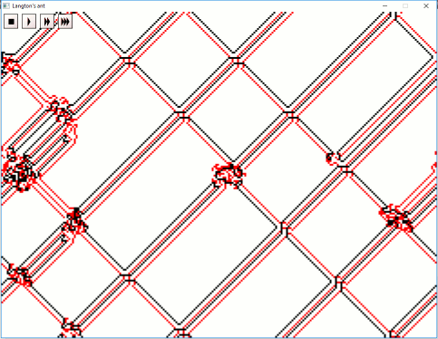

## Langton's Ant using SDL2 ##

A simple implementation of Langton's Ant using SDL2.

#### Prequisites ####

- MSYS2
- MinGW

#### MSYS2 packages required ####

- gcc (`mingw-w64-x86_64-gcc`)
- make (`mingw-w64-x86_64-make`)
- CMake (`mingw-w64-x86_64-cmake`)
- SDL2 (`mingw-w64-x86_64-SDL2`)

#### Configure ###

    cd langton
    mkdir build
    cd build
    cmake .. -G 'MSYS Makefiles'

### Build & run ###

    cmake --build .
    cd ..
    build/langton
