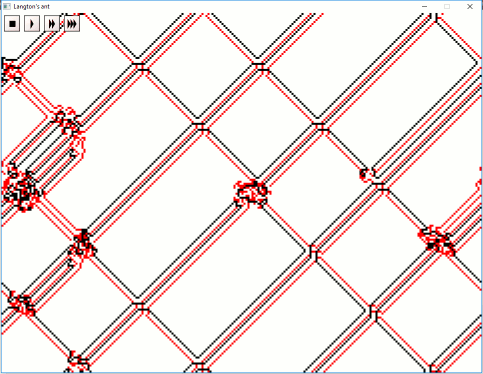
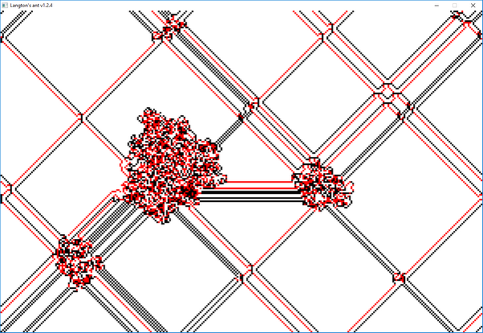
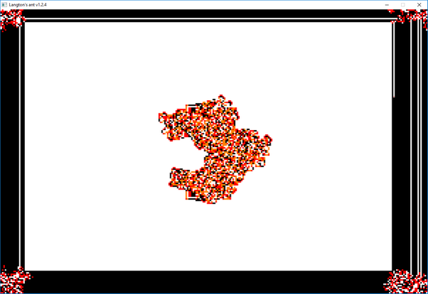
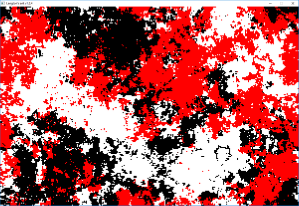
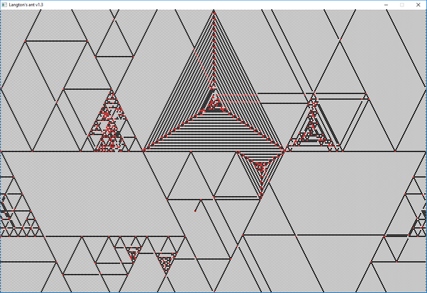

## Langton's Ant using SDL2 ##

A simple implementation of Langton's Ant using SDL2.



- [About Langton's Ant](https://en.wikipedia.org/wiki/Langton%27s_ant)

#### Prequisites ####

###### Supported builds ######

- Windows (MSYS2+MinGW)
- Linux

###### Packages required ######

| Name    | MinGW32/64        | Linux            |
|---------|-------------------|------------------|
| gcc     | `mingw-*-*-gcc`   | `gcc`            |
| make    | `mingw-*-*-make`  | `make`           |
| CMake   | `mingw-*-*-cmake` | `cmake`          |
| SDL2    | `mingw-*-*-SDL2`  | `libsdl2-dev`    |
| JsonCpp | *(included)*      | `libjsoncpp-dev` |

#### Build (MSYS2/Linux) ####

###### Configure ######

    cd langton/build
    cmake .. -G 'MSYS Makefiles'
    cd ..

###### Build & run ######

    cd build ; cmake --build . ; cd ..
    build/langton

#### Configure ####

The size of the grid, the number of ants, and the behavior of the ants can be changed by editing `langton.json`.

## Some examples ##

##### Islands and highways #####

```json
{
  "langton_colony": {
    "ants": [
      { "x": 100, "y": 80, "turn": [ "left", "right", "left" ]  },
      { "x": 200, "y": 120, "turn": [ "left", "left", "right" ]  }
    ],
    "grid" : { "height": 200, "width": 300 }
  }
}
```




##### Framed picture #####

```json
{
  "langton_colony": {
    "ants": [
      { "x": 150, "y": 80, "turn": [ "left", "left", "right", "left" ]  },
      { "x": 150, "y": 120, "turn": [ "right", "right", "left", "right" ]  },
	    { "x": 299, "y": 199, "turn": [ "ahead", "back", "wait", "random" ]  }
    ],
    "grid" : { "height": 200, "width": 300 }
  }
}
```



##### Territories #####

```json
{
  "langton_colony": {
    "ants": [
      { "x": 100, "y": 100, "turn": [ "random", "wait", "wait" ]  },
      { "x": 100, "y": 100, "turn": [ "wait", "random", "wait" ]  },
      { "x": 100, "y": 100, "turn": [ "wait", "wait", "random" ]  }
    ],
    "grid" : { "height": 200, "width": 300 }
  }
}
```



##### Triangles #####

```json
{
  "langton_colony": {
    "ants": [
      { "x": 100, "y": 100, "turn": [ "ahead", "hard left", "back" ]  }
    ],
    "grid" : { "height": 200, "width": 300, "type": "hex" }
  }
}
```


