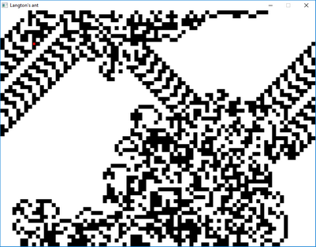

## Langton's Ant using SDL2 ##

A simple implementation of Langton's Ant using SDL2.

#### Prequisites ####

- MSYS2
- MinGW
- SDL2
- CMake

#### Build & run ###

    cd langton
    mkdir build
    cd build
    cmake .. -G 'MSYS Makefiles'
    cmake --build .
    ./langton
